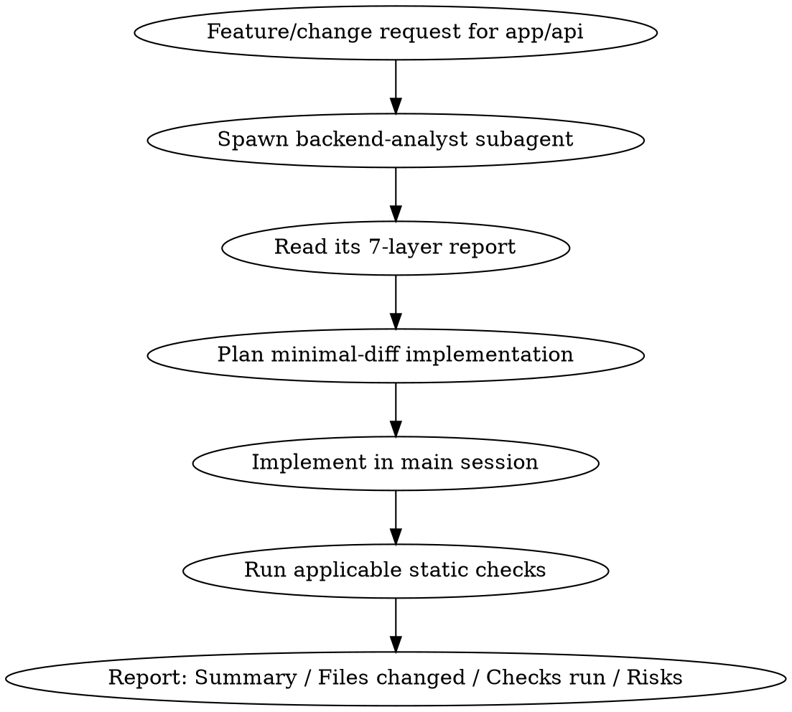

# Implementing API Changes

## Overview

Backend changes in `app/api` go wrong when implementation starts from assumptions about the existing layout instead of the actual code. This skill sequences the work: investigate via a read-only subagent first, implement with the smallest diff that satisfies the request, then verify with the checks the project actually has configured.

## Workflow



### 1. Investigate first — always via the subagent

Never read through `app/api` yourself to "get a feel for it" before implementing — dispatch the `backend-analyst` agent (Agent tool, `subagent_type: backend-analyst`) and let it produce the report. Build the prompt yourself for the specific request; don't reuse a generic one. Include:

- The exact feature/endpoint/change being requested, in your own words.
- Which of the 7 layers (domain, routes, use-cases, repositories, contracts, mappers, shared libs) are most likely touched, so the agent's investigation is targeted, not exhaustive-by-default.
- Any constraint from the request that changes what's relevant (e.g. "this must reuse the existing X mapper if one exists").

`backend-analyst` is read-only and reports only — it never edits code, even if the investigation surfaces an obvious fix. If mid-investigation it looks like the agent is about to be asked to change something, that request belongs in your own implementation step, not the agent's.

### 2. Plan from the report, not from memory

Use the returned file:line references and the "Gaps & recommendations" section to decide where new code belongs and what already exists to reuse. If the report shows a layer is absent, follow the convention it found elsewhere in the codebase rather than inventing a new one.

### 3. Implement with minimal diff

Change only what the request requires. Do not refactor adjacent code, rename things "while you're in there," or restructure layers beyond the request's scope — even if the analyst's report flagged unrelated improvement opportunities. Note those as Risks/TODO in the final report instead of acting on them.

### 4. Verify — run what the project actually has

Run from `app/api/`, and only the checks that apply:

| Check | When to run | Command | If not configured |
|---|---|---|---|
| Typecheck | Always, any `app/api` change | `yarn build` | N/A — always present |
| Lint | If `package.json` has a `lint` script | `yarn lint` | Note "no lint script configured — skipped" |
| Unit tests | If `test/` has matching tests or `package.json` has a `test` script | `yarn test` | Note "no tests found for this change — skipped" |
| CDK Nag | If `cdk-nag` is a dependency or an `Aspects.add(...)` nag check exists in `bin/*.ts`, and this change touched `lib/`/`bin/` | `yarn cdk synth` (nag runs as part of synth) — check output for `AwsSolutions-*` errors | Note "cdk-nag not wired into this stack — skipped" |
| CDK Diff | If this change touched `lib/` or `bin/` (infra files) | `yarn cdk diff` | If it fails on missing AWS credentials, note that in Risks rather than treating it as a blocking failure |

`yarn cdk synth` is always safe to run (local only, no AWS calls). `yarn cdk diff` contacts AWS read-only to compare against the deployed stack — never run `yarn cdk deploy` or `yarn cdk bootstrap` as part of this skill (see the repo's git-workflow/api-verification rules).

## Output format

End every implementation with exactly these four sections:

```markdown
## Summary
What changed and why, in 1-3 sentences.

## Files changed
- path/to/file.ts — one-line description of the change

## Checks run
- yarn build: pass/fail
- yarn lint: pass / skipped (no script)
- yarn test: pass/fail / skipped (no tests)
- cdk nag: pass / skipped (not configured)
- cdk diff: <summary of diff> / skipped (no infra change) / failed (reason)

## Risks / remaining TODO
- Anything the analyst's report flagged as a gap but that was out of scope for this change
- Anything a check couldn't verify (e.g. cdk diff skipped due to missing credentials)
```

## Common mistakes

- Skipping the subagent and reading `app/api` directly — loses the structured 7-layer report and tempts scope creep during exploration.
- Asking `backend-analyst` to "fix" or "scaffold" something — it will decline; do that work in the main session after reading its report.
- Running every check unconditionally — `app/api` doesn't have `lint` or `cdk-nag` configured yet; report them as skipped rather than failing the task or silently ignoring them.
- Treating a `cdk diff` credential failure as a hard blocker — report it as a risk, don't stop the task over it.
