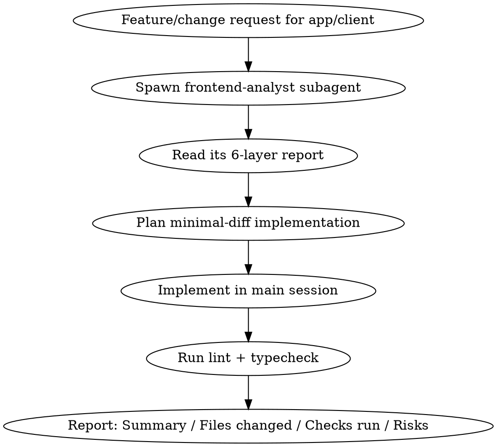

# Implementing Frontend Changes

## Overview

Frontend changes in `app/client` go wrong when implementation starts from assumptions about the existing structure instead of the actual code — especially since this project is mid-migration off CRA boilerplate and its shape shifts often. This skill sequences the work: investigate via a read-only subagent first, implement with the smallest diff that satisfies the request, then verify with lint and typecheck.

## Workflow



### 1. Investigate first — always via the subagent

Never read through `app/client` yourself to "get a feel for it" before implementing — dispatch the `frontend-analyst` agent (Agent tool, `subagent_type: frontend-analyst`) and let it produce the report. Build the prompt yourself for the specific request; don't reuse a generic one. Include:

- The exact feature/page/change being requested, in your own words.
- Which of the 6 layers (pages/routes, components, API layer, state management, styling/theme, shared/util libs) are most likely touched, so the agent's investigation is targeted, not exhaustive-by-default.
- Any constraint from the request that changes what's relevant (e.g. "this must reuse the existing MUI theme tokens" or "this must call the existing `apiClient` instance, not a new axios instance").

`frontend-analyst` is read-only and reports only — it never edits code, even if the investigation surfaces an obvious fix. If mid-investigation it looks like the agent is about to be asked to change something, that request belongs in your own implementation step, not the agent's. Only skip dispatching it if the user has explicitly told you to change specific, already-known lines without further investigation.

### 2. Plan from the report, not from memory

Use the returned file:line references and the "Gaps & recommendations" section to decide where new code belongs and what already exists to reuse. If the report shows a layer is absent or thin, follow the convention it found elsewhere in the codebase (e.g. existing MUI/Zustand/axios patterns) rather than inventing a new one.

### 3. Implement with minimal diff

Change only what the request requires. Do not refactor adjacent components, rename things "while you're in there," reorganize the store/theme structure, or touch unrelated pages — even if the analyst's report flagged unrelated improvement opportunities. Note those as Risks/TODO in the final report instead of acting on them.

### 4. Verify — lint and typecheck

Run from `app/client/`. `package.json` has no dedicated `lint` or `typecheck` scripts, so invoke the underlying tools directly:

| Check | Command | If it fails to run at all |
|---|---|---|
| Typecheck | `npx tsc` (tsconfig already sets `noEmit: true`) | Note "tsc unavailable — skipped" |
| Lint | `npx eslint src --ext .js,.jsx,.ts,.tsx` (uses the `eslintConfig` block in `package.json`, no separate config file) | Note "eslint unavailable — skipped" |

Do not run `npm test` or `npm start` as part of this verification step — this project's tests are not run as part of frontend changes.

## Output format

End every implementation with exactly these four sections:

```markdown
## Summary
What changed and why, in 1-3 sentences.

## Files changed
- path/to/file.tsx — one-line description of the change

## Checks run
- npx tsc: pass/fail
- npx eslint: pass/fail (N warnings/errors if any)

## Risks / remaining TODO
- Anything the analyst's report flagged as a gap but that was out of scope for this change
- Anything a check couldn't verify
```

## Common mistakes

- Skipping the subagent and reading `app/client` directly — loses the structured 6-layer report and tempts scope creep during exploration.
- Asking `frontend-analyst` to "fix" or "scaffold" something — it will decline; do that work in the main session after reading its report.
- Reusing a generic investigation prompt across requests instead of writing one targeted at the actual feature/layers in question.
- Running `npm test` after a client change — not part of this workflow; skip it.
- Treating lint warnings as automatically blocking — report the actual pass/fail and warning count, and let the user decide whether warnings block the change.
